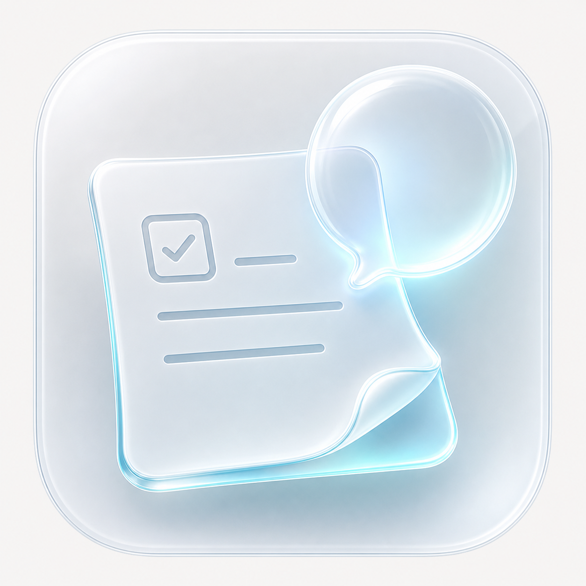
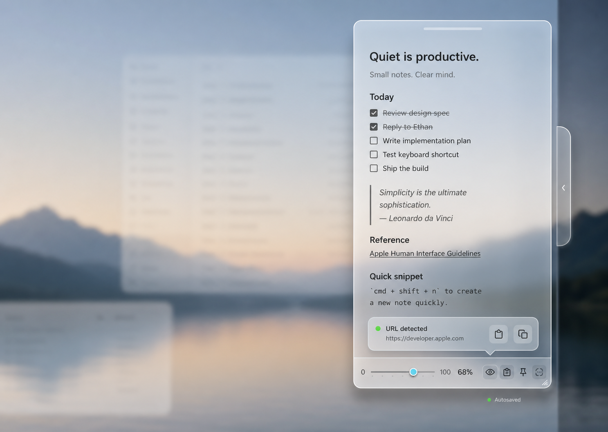

<div align="center">



# LumaNote

[English](README.md) | [中文](README.zh-CN.md)

**A translucent glass Markdown sticky note for macOS.**

**One command install · Live Markdown styling · Local clipboard library**



</div>

> The English and Chinese READMEs are maintained as content-equivalent versions. If one document changes, update the other in the same commit.

## Community

<p align="center">
  
</p>

<p align="center">
  Scan to join the WeChat group for discussion, product releases, and update notes.
</p>

## Why This Exists

LumaNote is built for the tiny notes that should stay close: a thought, a checklist, a link, an address, a verification code, or a Markdown draft you keep at the edge of the screen.

Most note apps become libraries, databases, or dashboards. LumaNote stays intentionally small: one elegant glass note, live Markdown styling, quick file switching, adjustable transparency, and a local clipboard library that can surface useful extracted values without taking over the screen.

## Installation

Recommended: download the latest DMG from GitHub Releases:

- [LumaNote-0.1.3-macos-arm64.dmg](https://github.com/hututuo/LumaNote/releases/latest/download/LumaNote-0.1.3-macos-arm64.dmg)

Verify the checksum published with the release:

```bash
curl -fL https://github.com/hututuo/LumaNote/releases/latest/download/LumaNote-0.1.3-macos-arm64.dmg -o LumaNote-0.1.3-macos-arm64.dmg
curl -fL https://github.com/hututuo/LumaNote/releases/latest/download/SHA256SUMS-v0.1.3.txt -o SHA256SUMS-v0.1.3.txt
grep 'LumaNote-0.1.3-macos-arm64.dmg' SHA256SUMS-v0.1.3.txt | shasum -a 256 -c -
```

Open the DMG and drag `LumaNote.app` to `Applications`.

Backup install with the GitHub Release zip:

```bash
APP_NAME="LumaNote"
ASSET_NAME="LumaNote.app.zip"
DOWNLOAD_URL="https://github.com/hututuo/LumaNote/releases/latest/download/${ASSET_NAME}"
TMP_DIR="$(mktemp -d)"
TARGET="$HOME/Applications/${APP_NAME}.app"

mkdir -p "$HOME/Applications"
curl -fL "$DOWNLOAD_URL" -o "$TMP_DIR/$ASSET_NAME"
ditto -x -k "$TMP_DIR/$ASSET_NAME" "$TMP_DIR"
APP_PATH="$(find "$TMP_DIR" -maxdepth 1 -name "${APP_NAME}.app" -type d -print -quit)"
ditto "$APP_PATH" "$TARGET"
xattr -dr com.apple.quarantine "$TARGET"
open "$TARGET"
```

This build is ad-hoc signed and is not Apple notarized. macOS may show an "unidentified developer" warning on first launch. Download only from the official release page and verify the SHA256 checksum before opening.

If macOS blocks the first launch, open `System Settings` -> `Privacy & Security`, find the LumaNote warning, click `Open Anyway`, then confirm `Open`.

## Source Install

macOS 14+ with Swift / Xcode Command Line Tools:

```bash
curl -fsSL https://raw.githubusercontent.com/hututuo/LumaNote/test/ad-hoc-permission-update/install.sh | bash
```

The installer clones or updates the repository under `~/.lumanote/source`, builds and ad-hoc signs the app locally, installs it to `~/Applications/LumaNote.app`, and opens it.

If you publish this repository under a different URL, override the clone source:

```bash
LUMANOTE_REPO=https://github.com/your-name/LumaNote.git \
  curl -fsSL https://raw.githubusercontent.com/your-name/LumaNote/main/install.sh | bash
```

## Manual Build

```bash
git clone https://github.com/hututuo/LumaNote.git
cd LumaNote/app/QuietNote
./scripts/build-app.sh
./scripts/build-dmg.sh
open build/LumaNote.app
```

## Key Features

| Feature | What it does |
|---|---|
| Glass sticky note | A compact frosted-glass note designed to live at the edge of the screen. |
| Adjustable transparency | Bottom slider controls note shell visibility while keeping text and controls readable. |
| Live Markdown styling | Edit plain Markdown directly; headings, links, lists, task checkboxes, code, highlights, and common inline styles are styled in place. |
| Task checkboxes | `- [ ]` and `- [x]` render as clickable checkboxes with task-list Return behavior. |
| Recent file switcher | Bottom switch button opens a compact recent-file panel, with Open New File as the first row. |
| Save As | Save the current note as a Markdown/text file and continue live-saving to that file. |
| Clipboard library | Local clipboard history with search, retention settings, copy, paste, and delete. |
| Clipboard extraction | Detects URLs, email addresses, phone numbers, address-like text, and labeled codes from each clipboard item. |
| Top island suggestions | Extracted clipboard values can appear in a compact top island for quick copy, paste, open URL, email, call, or map actions. |
| Global shortcuts | Configurable shortcuts for showing the note, hiding the note, and opening the clipboard library. |
| Launch at login | Optional macOS Login Items integration so LumaNote can open automatically after sign-in. |
| Chinese / English UI | Built-in app chrome language switch. Markdown content is not translated or changed. |

## Markdown Compatibility

LumaNote saves note content as plain Markdown. The editor is a lightweight live styler, not a full CommonMark or GitHub-Flavored Markdown renderer.

See the full table:

- [Markdown Compatibility](docs/markdown-compatibility.md)

## Local Data

LumaNote stores app data locally under:

```text
~/Library/Application Support/QuietNote/
```

Clipboard monitoring is local and can be disabled from the in-note menu or Settings.

## Permissions, Updates, And Dependencies

The DMG and zip builds bundle the Swift app and Sparkle framework. Users do not need Homebrew, Node.js, Python, a local server, an MCP server, a daemon, or a sidecar process.

Optional permissions:

- Login Items: used only if you enable Launch at Login.
- Clipboard access: used locally when clipboard monitoring is enabled.

Updates use Sparkle with EdDSA-signed appcast metadata. The appcast is currently hosted at:

```text
https://raw.githubusercontent.com/hututuo/LumaNote/test/ad-hoc-permission-update/appcast-test/appcast.xml
```

Sparkle's private signing key is not stored in this repository. Release operators should keep it in the login Keychain under account `com.hututuo.lumanote`, or in a user-private file such as `~/.config/lumanote/sparkle-ed25519-private.key` passed through `SPARKLE_PRIVATE_KEY_FILE`.

## Repository Layout

```text
LumaNote/
  app/QuietNote/                 # SwiftUI macOS app source
    Sources/                     # App code, grouped by feature
      App/                       # App entry, settings, shortcuts, updates
      Clipboard/                 # Clipboard monitoring, detection, library UI
      Markdown/                  # Live Markdown editor and styling
      NoteWindow/                # Main note shell, chrome, panels
      Notes/                     # Markdown file storage and workspaces
      Onboarding/                # First-launch guide
      Settings/                  # Full settings and compact more menu
      Window/                    # AppKit window, drag, overlay helpers
    scripts/build-app.sh         # Builds build/LumaNote.app
    scripts/build-dmg.sh         # Builds a drag-to-Applications DMG
    support/Info.plist           # Bundle metadata
    support/AppIcon.icns         # macOS app icon
  assets/                        # README icon and WeChat QR image
  docs/markdown-compatibility.md # Markdown support table
  install.sh                     # One-command installer
  README.md
  README.zh-CN.md
```

## Development

```bash
cd app/QuietNote
swift build
./scripts/build-app.sh
./scripts/build-dmg.sh
open build/LumaNote.app
```

Prepare release artifacts:

```bash
cd app/QuietNote
LUMANOTE_SKIP_APPCAST=1 ./scripts/prepare-release.sh
```

For a signed appcast build, make the Sparkle private key available and omit `LUMANOTE_SKIP_APPCAST=1`.

Build outputs, `.build/`, `build/`, and local run artifacts are intentionally ignored.

## License

MIT. See [LICENSE](LICENSE).

## Notes

The local bundle is ad-hoc signed during `./scripts/build-app.sh`, which is useful for local installation and update workflows but is not the same as Developer ID signing or notarization.
